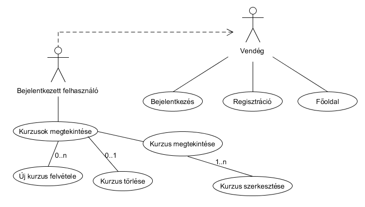

# Alkfejl

##Tárgyak felvétele (mini neptun program)

###Dokumentáció

####Tárgyfelvétel( mini neptun)

#####1.1 Célkitűzés, projectindító dokumentum

A program egy kis tárgyfelvelő alkalmazás(mini neptun) amely lehetővé teszi az adott tárgyak tulajdonságait, tematikájának megtekintését egyoldalo alkalmazás felhasználásával. Adatok védelme érdekében van lehetőség regisztrációra, később bejelentkezésre. Bejelentkezett felhasználó láthatja a kurzusok listáját, módosíthat, törölhet avagy új kurzust adhat a listához.

Funkcionális követelmények:
* Regisztráció
* Bejelentkezés
* Csak bejelentkezett felhasnálók által elérhető funkciók
  + új kurzus felvétele a listába
  + meglévő kurzusok megtekintése
  + meglévő kurzusok szerkesztése
  + meglévő kurzusok törlése

Nem funkcionális követelmények:
+ **Használhatóság:** Könnyű áttekinthetőség, ésszerű elrendezés, könnyen kezelhetőség
+ **Megbízhatóság:** Hibásan bevitt adatok esetén a program jól láthatóan jelezzen a felhasználónak, és emelje ki a hibás beviteli mezőket. A jól bevitt adatok maradjanak az űrlapban.
+ **Karbantarthatóság:** könnyen lehessen bővíteni, a különböző típusú fájlok külön csoportosítva, ésszerűen legyenek felbontva, a könnyebb fejleszthetőség miatt.

#####1.2 Célkitűzés, projectindító dokumentum
* **Kurzus:** Tantárgyak
* **Kredit:** Tantárgy értéke pontokban, diákok harcolnak értük
* **Tematika:** Tárgy részletes leírása
* **Óraszám:** Heti hány órát foglal el a tárgy

#####1.3 Használatieset-modell, funcionális követelmények

**Vendég:** Csak publikus oldalakat érhet el
  * Főoldal
  * Bejelentkezés
  * Regisztráció
  
**Bejelentkezett felhasználó**: A publikus oldalak elérésén felül egyéb funkciókhoz is hozzáfér.  
  *	Új kurzus felvétele
  *	Meglévő kurzus megtekintése
  *	Meglévő kurzus szerkesztése
  *	Meglévő kurzus törlése
  

**Meglévő kurzus szerkesztése:**
1.	A felhasználó az oldalra érkezve, bejelentkezik vagy regisztrál
2.	Regisztráció után megtekintheti a kurzusokat listázó oldalt, ahol kiválaszthatja a szerkeszteni kívánt kurzust.
3.	Megnyomja a „Megtekintés” feliratú gombot.
4.	A megtekintés oldalon kiválaszthatja a „Szerkesztés” gombot.
5.	Szerkesztés oldalon felviszi az új adatokat.
6.	Submit gombra kattintva elmenti a változásokat.
  
  
